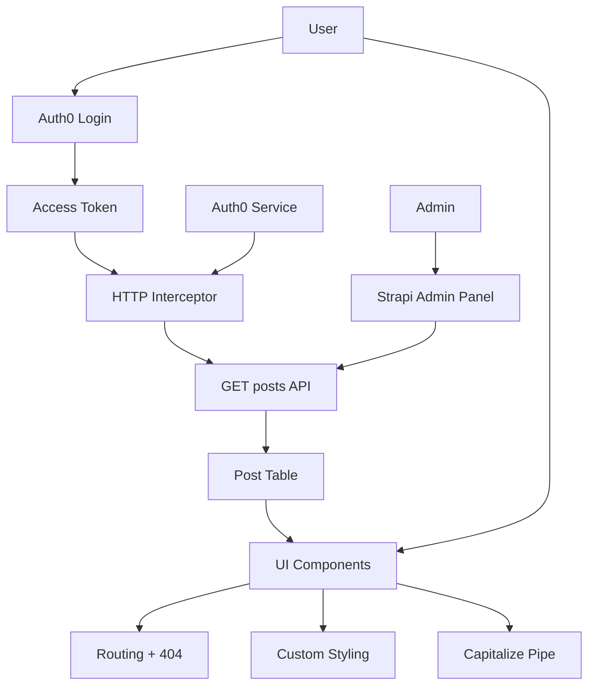

```mermaid
flowchart TD

    %% Users
    User[User] --> Auth0[Auth0 Login]
    Auth0 --> Token[Access Token]
    Token --> Interceptor[HTTP Interceptor]

    %% Frontend
    Interceptor --> PostsAPI[GET posts API]
    PostsAPI --> PostTable[Post Table]
    PostTable --> UI[UI Components]
    UI --> Routing[Routing + 404]
    UI --> Styling[Custom Styling]
    UI --> Pipe[Capitalize Pipe]

    %% Auth Service Hookup
    AuthService[Auth0 Service] --> Interceptor
    User --> UI

    %% Admin
    Admin[Admin] --> StrapiPanel[Strapi Admin Panel]
    StrapiPanel --> PostsAPI

```