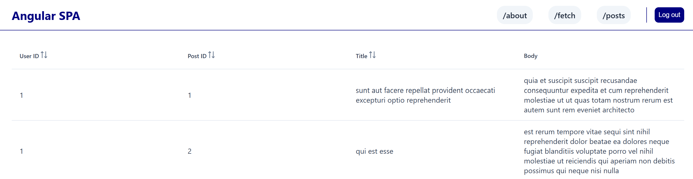

# 🌐 Angular Blog App

A modern web application built with **Angular**, designed for authenticated users to fetch and view posts. The app
leverages **Auth0** for secure authentication, **Strapi** as a CMS for content management, and **PrimeNG** for a sleek,
responsive UI.

---

## 🚀 Features

- **🔐 Auth0 Authentication**
Secure and seamless login experience using Auth0. Sessions are preserved in local storage for smooth user experience.

- **✍️ Content Management with Strapi**
Admins can create and manage blog posts using Strapi as the headless CMS backend.

- **💡 Modern UI with PrimeNG**
Built using PrimeNG components for an interactive and visually appealing frontend.

- **🛰️ HTTP Interceptors**
- Automatically includes Auth0 Bearer tokens in all API requests.
- Logs all HTTP fetch requests for easier debugging and observability.

- **📆 Sort & View Posts**
Posts can be sorted by date, and each post displays with a styled date component using PrimeNG.

- **🎨 Custom Styling**
Application is styled with CSS enhancements for layout, responsiveness, and visual polish.

---

## 📦 Tech Stack

| Layer | Tech |
|----------------|---------------------|
| Frontend | Angular |
| Auth | Auth0 |
| UI Components | PrimeNG |
| CMS / Backend | Strapi |
| Styling | CSS |

---

## 🛠 Development Highlights

- Post sorting by date.
- Skeleton loaders for tables and data views.
- Auth0 integration with persistent login sessions.
- Custom Angular pipe to capitalize text.
- Route management with a 404 fallback page.
- Responsive theming using PrimeNG and custom styles.
- Dynamic date component with opacity control.
- API requests intercepted for Bearer token injection.

---

## 📸 Screenshots



---

## 📦 Setup & Installation

```bash
# Clone the repository
git clone https://github.com/STMStaj/auth-zero-angular-example
cd auth-zero-angular-example

# Install dependencies
npm install

# Serve the app locally
npm start

# Serve the dashboard locally in another shell
cd auth-zero-strapi
npm run develop
```